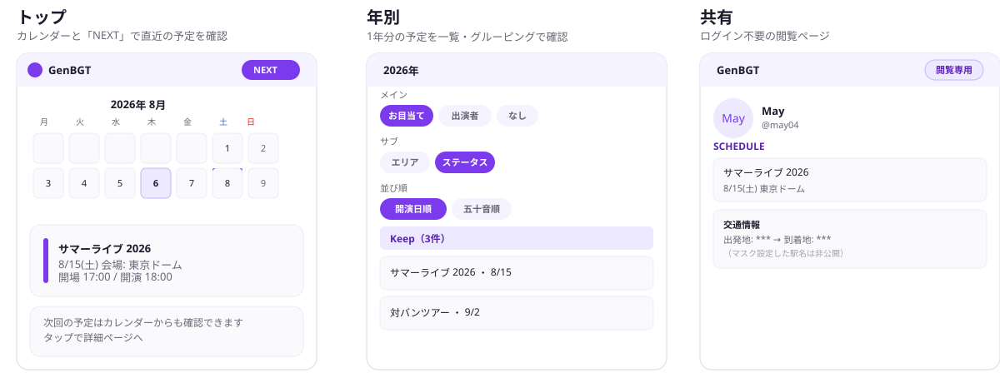
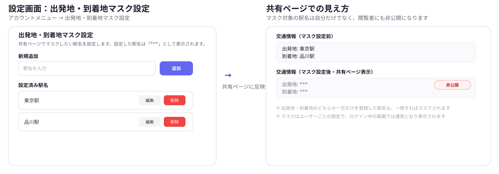
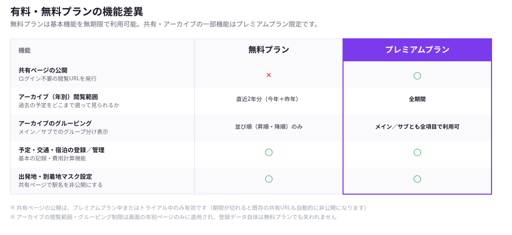

# GenBGT

ライブ予定を整理し、共有ページで公開できるアプリです。

## 画面の役割
- トップ: カレンダーと「NEXT」で直近の予定を確認
- 年別: 1年分の予定を一覧・グルーピングで確認
- 共有: ログイン不要の閲覧ページ

> 上図はUIの構成を示すモックアップです（実データではありません）。実際の共有ページの例は https://www.genbgt.com/share/may04 で確認できます。

## 使い方（基本の流れ）

### 1) ログイン
- 通常はログインして利用します
- 共有ページはログイン不要で閲覧できます

### 2) 予定を追加する
- タイトル、日付、会場、エリアを入力
- 必要に応じて「お目当て」「出演者」「カテゴリ」「ステータス」を設定
- 「Select」「Multi-select」フィールドは、ユーザーごとに選択肢を追加できます  
  （対象フィールドは `DATABASE_SCHEMA.md` を参照）

### 3) 交通・宿泊・費用を管理する
- 交通情報を追加すると合計費用が自動計算されます
- 宿泊情報でチェックイン/アウトや費用を管理できます

### 4) 年別ページで整理する
- メイン/サブを選んでグルーピング表示
- メインが「お目当て」「出演者」のときは並び替え可能  
  （デフォルト / 開演日順 / 五十音順）

### 5) 共有ページを使う
- 共有リンクを発行するとログイン不要で閲覧できます
- 共有ページは閲覧専用です（編集はログインが必要）

### 6) 出発地・到着地をマスクする
- アカウントメニューの「出発地・到着地マスク設定」から、共有ページで隠したい駅名を登録できます
- 登録した駅名は、交通情報の出発地・到着地として一致した箇所が共有ページ上で「***」と表示されます
- マスクはログイン中の自分の画面には影響しません（閲覧者にのみ非公開になります）

## 表示ルール（ステータス）
- トップのカレンダーとNEXTには「Canceled」を表示しません
- 年別ページはサブを「ステータス」にした場合のみ「Canceled」を表示します

## グルーピングの選択肢
- メイン: なし / お目当て / 出演者
- サブ: グループ / カテゴリ / エリア / 販売元 / ステータス

## 有料・無料プランの機能差異

登録・記録まわりの基本機能は無料プランでも無期限で使えます。共有ページの公開と、年別ページのアーカイブ閲覧・グルーピングの一部がプレミアムプラン（または1ヶ月無料トライアル）限定です。

| 機能 | 無料プラン | プレミアムプラン |
|------|-----------|-----------------|
| 共有ページの公開 | 🔒 利用不可（要プレミアム） | 利用可 |
| 年別ページの閲覧範囲 | 直近2年分（今年＋昨年） | 全期間 |
| 年別ページのグルーピング | 並び順（昇順・降順）のみ | メイン/サブとも全項目で利用可 |
| 予定・交通・宿泊の登録/管理 | 利用可 | 利用可 |
| 出発地・到着地マスク設定 | 利用可 | 利用可 |
| 1ヶ月無料トライアル | アカウントごとに1回、開始可能 | （プレミアムのため対象外） |

- プランはアカウントメニューから確認でき、無料プランの場合はここから1ヶ月無料トライアルを開始できます（1アカウント1回のみ）
- 共有ページの公開はプレミアム中・トライアル中のみ有効です。期限が切れると、既存の共有URLも自動的に非公開になります（再度プレミアムになれば同じURLで再開できます）
- 年別ページの閲覧範囲・グルーピング制限は画面表示のみの制限です。無料プランでも登録データ自体が削除されることはありません

